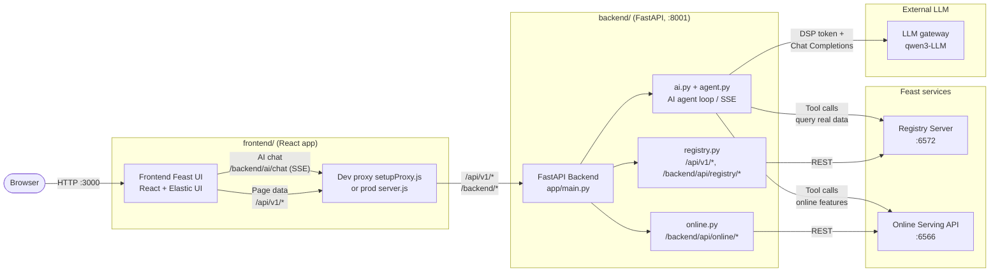
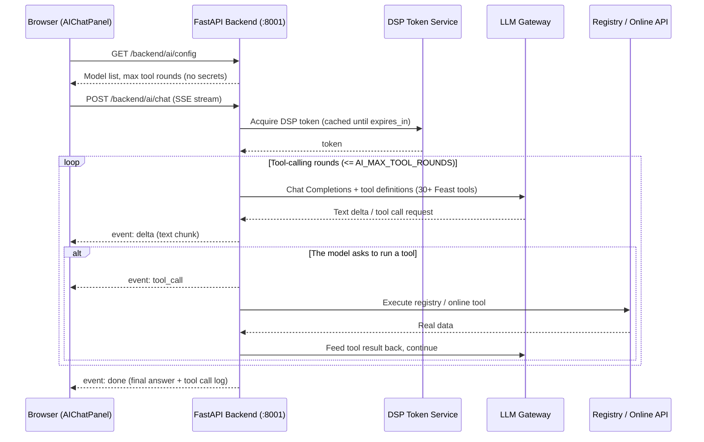

# Feast UI — Feature Platform Web UI + LLM Assistant

A feature platform management UI built on [Feast](https://feast.dev/) 0.66.0.
The frontend is React + Elastic UI, and the backend is FastAPI. Besides the
standard Feast UI pages (projects / data sources / entities / feature views /
feature services, etc.), it ships with an **LLM assistant (FCIS Assistant)**
that can answer questions about the feature platform by querying real data.

The browser **never talks directly** to the downstream services (the Registry
Server, the Online Serving API, and the LLM gateway do not send CORS headers).
All requests go through a single FastAPI backend, which performs forwarding,
authentication (DSP token), and tool execution.

---

## Table of Contents

- [Architecture](#architecture)
- [Directory Layout](#directory-layout)
- [Feature Modules](#feature-modules)
- [Quick Start (How to Run)](#quick-start-how-to-run)
- [Configuration](#configuration)
- [API Overview](#api-overview)
- [Troubleshooting](#troubleshooting)

---

## Architecture

### Layer Overview

| Layer | Component | Port | Responsibility |
|-------|-----------|------|----------------|
| Presentation | Frontend `frontend/` (React + Elastic UI) | 3000 | Standard Feast UI pages + AI chat panel; the only browser entry point |
| Proxy | `setupProxy.js` (dev) / `server.js` (prod) | 3000 | Forwards `/api/v1` and `/backend` requests to the FastAPI backend |
| Business/Proxy | Backend `backend/` (FastAPI) | 8001 | CORS-safe forwarding, AI agent loop, DSP auth, configuration |
| Data services | Feast Registry Server (REST) | 6572 | Metadata registry (projects, entities, feature views, feature services, …) |
| Data services | Feast Online Serving API | 6566 | Online feature retrieval (`get-online-features`, etc.) |
| External | LLM gateway (DSP auth + OpenAI-compatible Chat Completions) | - | Provides models such as `qwen3-LLM` |

> In production the frontend can also be served directly by FastAPI from
> `frontend/build`, in which case `server.js` is not needed.

### System Architecture



### AI Chat Sequence



---

## Directory Layout

```
feast-ui/
├── backend/                        # FastAPI backend (the only entry to downstream services)
│   ├── run.py                      # python run.py to start (default 8001)
│   ├── requirements.txt
│   ├── .env.example                # Config template: copy to .env
│   └── app/
│       ├── main.py                 # Entry: CORS, router registration, /health, startup log
│       ├── core/
│       │   ├── config.py           # Config: shell env vars > .env > built-in defaults
│       │   └── proxy.py            # httpx client / SSL(truststore) / generic forwarding
│       ├── services/               # Business logic (non-HTTP, unit-testable)
│       │   ├── dsp.py              # DSP token client (cached until expires_in)
│       │   ├── tool_specs.py       # AI tool definitions (registry + online, 30+)
│       │   └── agent.py            # AI agent loop + OpenAI streaming + SSE
│       └── api/                    # HTTP endpoint layer, one file per downstream service
│           ├── registry.py         # /api/v1/* and /backend/api/registry/* → Registry
│           ├── online.py           # /backend/api/online/* → Online API
│           └── ai.py               # /backend/ai/config and /backend/ai/chat
├── frontend/                       # React frontend (based on the Feast UI source)
│   ├── src/
│   │   ├── setupProxy.js           # Dev proxy: /api/v1, /backend → :8001
│   │   ├── components/AIChatPanel.tsx  # AI chat panel
│   │   ├── utils/qwenAgent.ts      # Frontend AI client (SSE parsing)
│   │   └── pages/                  # Standard Feast UI pages
│   ├── public/
│   │   ├── projects-list.json      # Project list
│   │   └── registry.json           # Demo registry snapshot
│   ├── feature_repo/               # Sample Feast repository (credit_scoring_aws)
│   ├── server.js                   # Production server (static hosting + forwarding)
│   └── package.json
└── README.md
```

---

## Feature Modules

### 1. Frontend (React + Elastic UI)

**Standard Feast UI pages** (`src/pages/`) — metadata browsing and management:

- **Project list**: read from `projects-list.json`; each `registryPath` is
  rewritten to `/api/v1` so requests go through the backend proxy
- **Data Sources**, **Entities**
- **Feature Views** (Regular / On-Demand), **Features**
- **Feature Services**, **Label Views**
- **Saved Datasets** (including training dataset export)
- **Lineage**, **Monitoring** (feature metrics, time series, anomalies)
- **Permissions & resource stats**: Permissions, Resource Counts, Popular Tags, etc.

**AI assistant panel** (`src/components/AIChatPanel.tsx`):

- SSE streaming chat with word-by-word rendering (`event: delta`)
- Loads the available model list (`qwen3-LLM`, etc.) from `/backend/ai/config`; models are switchable
- Tool execution progress is shown live (`event: tool_call`), e.g. "Listing feature views…"
- All capabilities are wrapped by `src/utils/qwenAgent.ts`, which calls `POST /backend/ai/chat`

**Proxy layer**: `setupProxy.js` (webpack-dev-server) for development and
`server.js` for production; both forward `/api/v1/*` and `/backend/*` verbatim
to the FastAPI backend at `127.0.0.1:8001`.

### 2. Backend (FastAPI)

**API proxy layer** (`app/api/`):

| Route | Forwards to | Purpose |
|-------|-------------|---------|
| `/api/v1/*` | Registry Server `/api/v1/*` | Data for the standard Feast UI pages |
| `/backend/api/registry/*` | Registry Server `/api/v1/*` | AI tools and custom pages |
| `/backend/api/online/*` | Online Serving API | Online retrieval, vector search, push, materialization |
| `/backend/ai/config` | - | Returns browser-facing AI settings (no secrets) |
| `/backend/ai/chat` | LLM gateway | AI chat (SSE stream) |

**AI agent service** (`app/services/`):

- `dsp.py`: caches the DSP token until `expires_in` and refreshes it automatically;
  supports a degraded path when credentials are absent
- `tool_specs.py`: defines 30+ Feast tools (`list_projects`, `list_feature_views`,
  `get_online_features`, `search_resources`, lineage, monitoring,
  materialization, vector search, etc.)
- `agent.py`: the agent loop — acquire DSP token → call the LLM (OpenAI-compatible
  protocol, TLS via `httpx` + the OS trust store) → execute tools on demand →
  stream real data back to the browser

**Configuration** (`app/core/config.py`): precedence is
**shell env vars > `backend/.env` > built-in defaults**.

### 3. Feast Services (data layer)

- **Registry Server** (REST, default `:6572`): holds feature platform metadata;
  started with `feast serve-registry --rest-api`
- **Online Serving API** (default `:6566`): online feature retrieval;
  started with `feast serve`
- **Sample repository** `frontend/feature_repo/`: the `credit_scoring_aws` project
  with a sqlite online store and pre-materialized features, ready for demos

---

## Quick Start (How to Run)

> The commands below are verified on **Windows** (Git Bash or PowerShell both work).

### Prerequisites

| Item | Requirement |
|------|-------------|
| Python | 3.12 (backend + Feast) |
| Node.js | v22.x |
| Feast | 0.66.0 (`pip install feast==0.66.0` or use the `feast-0.66.0` source) |

### Step 1: Start the Feast services (data layer)

Run the two Feast services inside the sample repository. `feature_repo` already
contains a prebuilt `registry.db` and a materialized sqlite online store, so no
extra `apply` is required.

```bash
cd frontend/feature_repo

# 1) Registry Server (REST API, default 6572)
feast serve-registry --rest-api

# 2) Online Serving API (default 127.0.0.1:6566) — in another terminal
feast serve --host 127.0.0.1 --port 6566
```

> For your own repository: run `feast apply` to register metadata, then
> `feast materialize-incremental` to materialize online features.

### Step 2: Start the FastAPI backend

```bash
cd backend
python -m venv venv
venv/Scripts/activate            # Windows; macOS/Linux: source venv/bin/activate
pip install -r requirements.txt
copy .env.example .env           # first time: fill in AI_ENDPOINT / DSP credentials if needed (see Configuration)
python run.py                    # listens on 0.0.0.0:8001
```

Verify: `curl http://127.0.0.1:8001/health` should return `{"status":"ok", ...}`.

### Step 3: Start the frontend

**Development mode** (hot reload, recommended for debugging):

```bash
cd frontend
npm install
npm start                        # listens on :3000; setupProxy.js forwards /api/v1, /backend to :8001
```

Open <http://localhost:3000> in the browser.

**Production mode** (static build + `server.js`):

```bash
cd frontend
npm run build                    # output goes to build/
node server.js                   # listens on :3000; serves build/ and forwards API calls
```

### Step 4: Verify

| Check | How |
|-------|-----|
| Frontend page | Open `http://localhost:3000`; the project list should appear |
| Registry data | `curl http://127.0.0.1:3000/api/v1/projects` should return 200 |
| AI config | `curl http://127.0.0.1:3000/backend/ai/config` should return the model list |
| AI chat | Open the AI panel in the top-right corner and ask a question (e.g. "List all feature views") |

---

## Configuration

All backend settings live in `backend/.env` (copy from `.env.example`). Precedence:
**shell env vars > `backend/.env` > built-in defaults**.

| Variable | Description | Default |
|----------|-------------|---------|
| `BACKEND_PORT` | Backend HTTP port | `8001` |
| `REGISTRY_URL` | Feast REST Registry Server | `http://127.0.0.1:6572` |
| `ONLINE_URL` | Feast Online Serving API | `http://127.0.0.1:6566` |
| `CORS_ORIGINS` | Allowed origins, comma-separated (`*` = all) | `*` |
| `AI_ENDPOINT` | LLM chat completions URL | built-in default |
| `AI_DEFAULT_MODEL` | Default model | `qwen3-LLM` |
| `AI_MODELS` | Selectable models, comma-separated | `qwen3-LLM` |
| `AI_LLM_USER` | Value for the request `user` field | built-in default |
| `AI_DSP_TOKEN_URL` | DSP token endpoint | built-in default |
| `AI_DSP_USERNAME` | DSP username | empty (DSP auth unavailable) |
| `AI_DSP_PASSWORD` | DSP password | empty (DSP auth unavailable) |
| `AI_MAX_TOOL_ROUNDS` | Max tool-calling rounds | `5` |
| `AI_MAX_TOKENS` | `max_tokens` per answer | `512` |

> If `AI_DSP_USERNAME` / `AI_DSP_PASSWORD` are empty, the AI chat falls back to
> a no-auth path; if `AI_ENDPOINT` is not configured, the AI assistant is
> unavailable (the startup log prints a `[WARN]`).

---

## API Overview

| Method | Path | Description |
|--------|------|-------------|
| GET | `/health` | Health check (returns registry / online / ai_enabled) |
| GET/POST/... | `/api/v1/*` | Standard Feast UI data → Registry Server |
| GET/POST/... | `/backend/api/registry/*` | Registry tools |
| GET/POST/... | `/backend/api/online/*` | Online Serving API tools |
| GET | `/backend/ai/config` | Browser-facing AI settings (no secrets) |
| POST | `/backend/ai/chat` | AI chat (SSE). body: `{"messages":[{"role":"user","content":"..."}],"model":"..."}` |

AI chat SSE events:

```
event: tool_call  data: {"name","args","ok","status","data"|"error"}
event: delta      data: {"content": "<text chunk>"}
event: done       data: {"answer","toolCalls"}
event: error      data: {"message"}
```

---

## Troubleshooting

**The frontend page loads but every data API returns 404** (the backend log shows
`GET /projects ... 404`)
- Usually the `setupProxy.js` proxy is not active or drops the prefix. `setupProxy.js`
  is loaded **only when the dev server starts** — restart `npm start` after editing it;
  the proxy must keep the `/api/v1` and `/backend` prefixes when forwarding (this project already does).

**AI chat reports `Request failed: AI request failed (404)`**
- First `curl http://127.0.0.1:8001/backend/ai/config` to confirm the backend is up (expect 200);
  then `curl http://127.0.0.1:3000/backend/ai/config` to confirm the frontend proxy chain;
  finally check `AI_ENDPOINT` and the DSP credentials in `backend/.env`.

**`feast serve` fails with `[Errno 10048]` (port already in use)**
- A previous server process is still running. Run `netstat -ano | findstr :6566` to find the PID,
  then `taskkill /PID <pid> /F` and start again.

**Changes to `setupProxy.js` / `server.js` do not take effect**
- Dev mode: restart `npm start`; production mode: restart `node server.js`.

**The AI assistant gives off-topic answers or refuses to answer**
- The agent is designed to answer **only from real tool results** and tells you honestly
  when it cannot find something; try a more specific question (e.g. "List the feature views
  under the credit_scoring_aws project").
